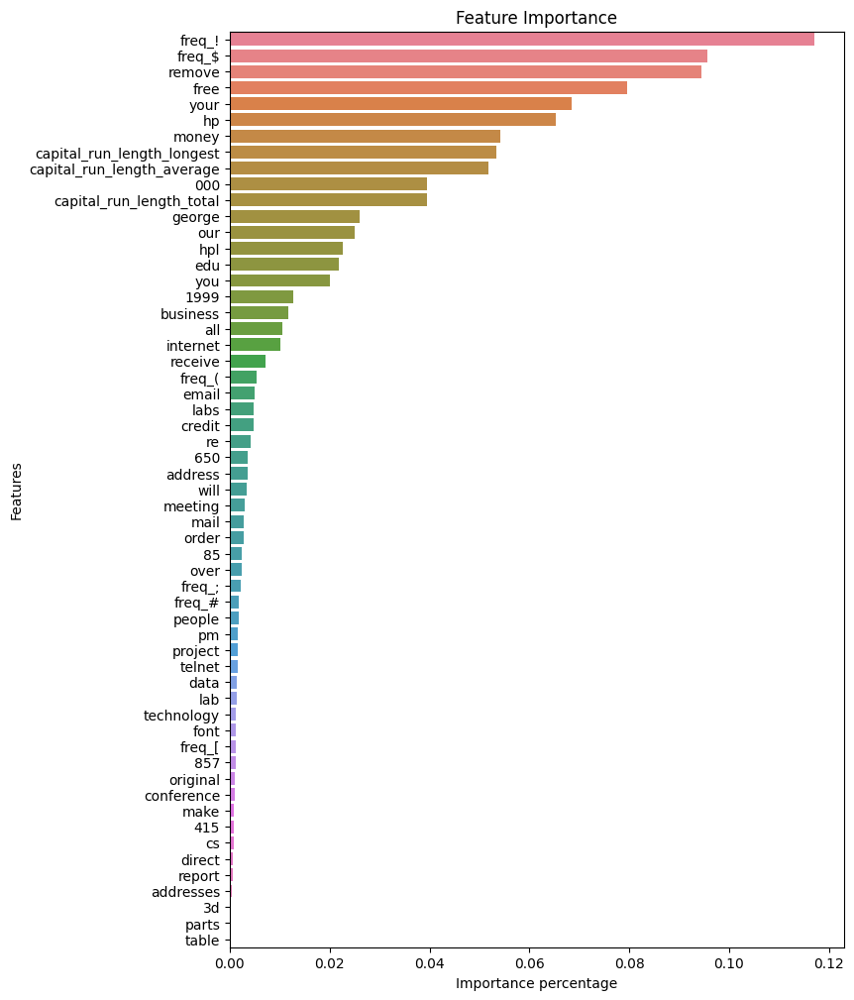
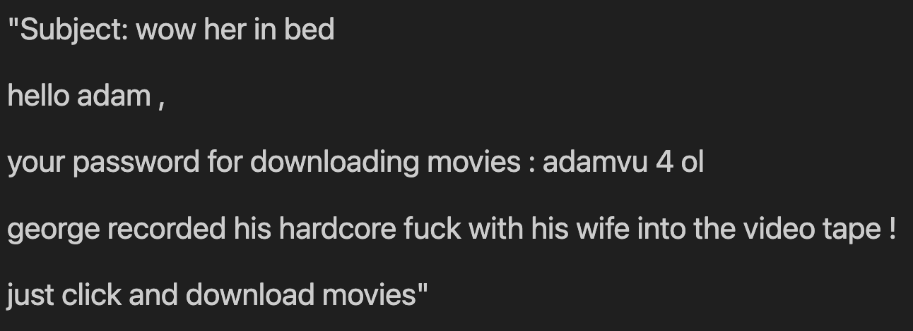
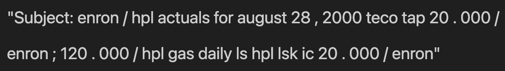

# 📧 탐색적 데이터 분석을 통한 스팸메일 예측
<br>

## 목차
1. 프로젝트 목표 및 기대효과
2. 머신 러닝 절차(파이프라인) 설명
    1) EDA
    2) 데이터 분류
    3) 모델 선정
    4) 학습 및 평가
    5) 피드백
3. 결론
   
<br>

---
# 1. 🎯 프로젝트 목표 및 기대효과
 * 스팸 메일의 패턴 분석
 * 분석을 바탕으로 스팸 의심 메일 분류


<p align="center">
  
</p>

<div align="center">
  그림 1.1 스팸 메일 분류
</div>
<br>

---
# 2. 📜 머신 러닝 절차(파이프라인)

## 1) 📊 EDA(Exploratory Data Analysis)
 * 데이터 전처리,인코딩 등
 * 이전 프로젝트의 진행내역 사용
<p align="center">
  
</p>

<div align="center">
  그림 2.1.1 EDA 프로젝트 개요 
</div>
<br>

---

## 2) 📑 데이터 분류
 * 학습 데이터, 테스트 데이터를 분류
 * 주요 매개변수
    * stratify
      - 지정한 feature 값의 비율로 데이터셋을 분리
    * train_size or test_size
      - 학습용 혹은 평가용 데이터 사이즈 설정

---

## 3) ✅ 모델 선정
 * 스팸 메일인지 아닌지 이진분류 ➡️ 분류모델 사용
  <p align="center">
    
  </p>

  <div align="center">
    그림 3.1 이진분류 이미지
  </div>
  <br>


## 4) 📈 학습 및 평가

  ### RandomizedSearchCV

  ```python
  lr_params =  {
            'penalty' : ['l1', 'l2'],
            'C' : np.arange(200) / 10,
            'solver' : ['lbfgs', 'newton-cg', 'liblinear']
            }
dt_params =  {
            'max_depth' : range(1, 8),
            'min_samples_split' : range(2, 11),
            'min_samples_leaf' : range(2, 11)
            }
svm_params =  {
            'C' : np.arange(200) / 10,
            'kernel' : ['linear', 'poly', 'rbf', 'sigmoid']
            }
knn_params =  {
            'n_neighbors' : range(3, 12, 2),
            'algorithm' : ['auto', 'ball_tree', 'kd_tree', 'brute']
            }
xgb_params =  {
            'learning_rate' : np.arange(101) / 100,
            'max_depth' : range(3, 9)
            }
lgbm_params =  {
            'learning_rate' : np.arange(101) / 100,
            'max_depth' : range(3, 9)
            }
hist_gb_params =  {
            'learning_rate' : np.arange(101) / 100,
            'max_depth' : range(3, 9),
            
            }

model_params = [lr_params, dt_params, svm_params, knn_params, xgb_params, lgbm_params, hist_gb_params]
  ```

  <div align="center">
  
  </div>
  <br>

  <p align="center">
    
  </p>

  <div align="center">
    그림 4.1 최적의 파라미터 탐색 결과
  </div>
  <br>

  ### KNN
  <p align="center">
    
  </p>

  <div align="center">
    그림 4.2 KNN precision, recall
  </div>
  <br>

  ### Decision Tree
  <p align="center">
    
  </p>

  <div align="center">
    그림 4.3 Decision Tree precision, recall
  </div>
  <br>

  ### Logistic Regression
  <p align="center">
    
  </p>

  <div align="center">
    그림 4.4 Logistic Regression precision, recall
  </div>
  <br>

  ### SVM (Support Vector Machine)
  <p align="center">
    
  </p>

  <div align="center">
    그림 4.5 SVM precision, recall
  </div>

  ### Hist Gradient Boosting
  <p align="center">
    
  </p>

  <div align="center">
    그림 4.6 Hist Gradient Boosting precision, recall
  </div>
  <br>

  ### XGBoost
  <p align="center">
    
  </p>

  <div align="center">
    그림 4.7 XGBoost precision, recall
  </div>
  <br>

  ### Voting

  <p align="center">
    
  </p>

  <div align="center">
    그림 4.8 voting_clf
  </div>
  <br>

  <p align="center">
    
  </p>

  <div align="center">
    그림 4.9 Voting clf precision, recall
  </div>
  <br>

---

  <p align="center">
    
  </p>

  <div align="center">
    그림 4.10 특성 중요도 시각화
  </div>
  <br>

  <p align="center">
    
  </p>
  <br>

  <p align="center">
    
  </p>
  <br>

  <p align="center">
    
  </p>
  <br>

<p align="center">
    
  </p>
  <br>

---

# 3. 🧩 결론
 
 **- 본 프로젝트를 통해 다양한 분류모델과 앙상블 방식을 사용, 각 모델의 최적의 파라미터를 탐색함**

 **- 특성 중요도 시각화를 통해 복잡하고 방대한 데이터의 분석을 효과적으로 진행함**

 **- 평소 직관적으로 알던 스팸메일에 일정한 패턴이 있다는 것을 수치 분석을 통해 확인함**

 **- 패턴분석이 완료된 한글 스팸 데이터셋을 발견하지 못해 외국의 데이터를 사용한 것이 아쉬움**
 
 **- 향후 패턴분석이 된 한글 데이터셋을 활용하거나 직접 한글 스팸 메일 패턴분석을 진행하여 더 향상된 분석 필요**

 ---
 # 데이터 출처
 
  - https://archive.ics.uci.edu/dataset/94/spambase
  - https://www.kaggle.com/datasets/venky73/spam-mails-dataset


