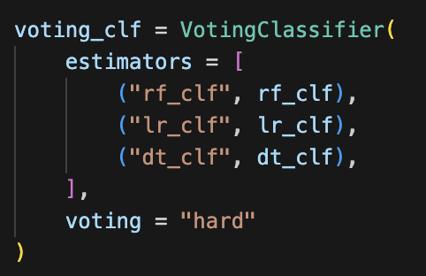
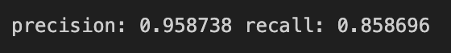

# SKN011-ML-6Team
- 이현민
- 정현욱
- 홍성욱

   
  
📅기간: 2025.03.14 ~ 2025.03.21
---
# 📧스팸메일 구별을 위한 탐색적 데이터 분석 (EDA)
 

## 목차
1. 프로젝트 목표 및 기대효과
2. 머신 러닝 절차(파이프라인) 설명
    1) EDA
    2) 데이터 분류
    3) 모델 선정
    4) 학습 및 평가
    5) 피드백
3. 결론
   
 

---
# 1. 🎯 프로젝트 목표 및 기대효과
 * 스팸 메일의 패턴 분석
 * 분석을 바탕으로 스팸 의심 메일 분류

  

  그림 1.1 스팸 메일 분류 이해를 도울 그림

 

---
# 2. 📜 머신 러닝 절차(파이프라인)

## 1) 📊 EDA(Exploratory Data Analysis)
 * 데이터 전처리,인코딩 등
 * 이전 프로젝트의 진행내역 사용

  

  그림 2.1.1 EDA 프로젝트 개요 

 

---

## 2) 📑 데이터 분류
 * 학습 데이터, 테스트 데이터를 분류 (보통 7:3)
 * 주요 매개변수
    * stratify
      - 지정한 feature 값의 비율로 데이터셋을 분리
    * train_size or test_size
      - 학습용 혹은 평가용 데이터 사이즈 설정

---

## 3) ✅ 모델 선정
 * 스팸 메일인지 아닌지 이진분류 ➡️ 분류모델 사용
  

    
  

  

    그림 3.1 EDA 프로젝트 개요 
  

   

## 4) 📈 학습 및 평가

  ### Logistic Regression
  

    
  

  

    그림 4.1 precision: 0.915068, recall: 0.920110
  

   

  ### Decision Tree
  

    
  

  

    그림 4.2 precision: 0.920732, recall: 0.831956
  

   

  ### SVM (Support Vector Machine)
  

    
  

  

    그림 4.3 precision: 0.928375, recall: 0.928375
  

   

  ### Voting

  

    
  

  

    그림 4.4 voting_clf
  

   

  

    
  

  

    그림 4.5 precision: 0.959427 recall: 0.873913
  

   

  ### KNN
  

    
  

  

    그림 4.6 precision: 0.881844, recall: 0.842975
  

   

  ### Hist Gradient Boosting
  

    
  

  

    그림 4.7 precision: 0.942466, recall: 0.947658
  

   

  ### XGBoost
  

    
  

  

    그림 4.8 precision: 0.940054, recall: 0.950413
  

   

---

# 3.🧩 결론
 
 **- 지난 EDA프로젝의 결론 중**

---
